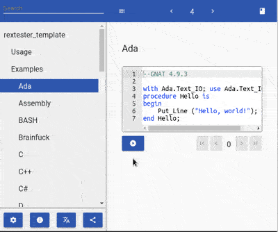

<!--

author:   André Dietrich
email:    andre.dietrich@ovgu.de
version:  0.3.0
language: en
narrator: US English Female

script:   https://ajax.googleapis.com/ajax/libs/jquery/1.11.3/jquery.min.js

@Ada:         39
@Bash:        38
@Basic:        2
@Brainfuck:   44
@C:            6
@C_clang:     26
@C_vc:        29
@CPP:          7
@CPP_clang:   27
@CPP_vc:      28
@CSharp:       1
@ClientSide:  36
@D:           30
@Elixir:      41
@Erlang:      40
@Fortran:     45
@FSharp:      3
@Go:          20
@Haskell:     11
@Java:         4
@JavaScript:  17
@Kotlin:      43
@Lisp:        18
@Lua:         14
@MySQL:       33
@Nasm:        15
@NodeJS:      23
@ObjectiveC:  10
@OCaml:       42
@Octave:      25
@Oracle:      35
@Pascal:       9
@Perl:        13
@PHP:          8
@PostgreSQL:  34
@Prolog:      19
@Python:       5
@Python3:     24
@R:           31
@Ruby:        12
@Scala:       21
@Scheme:      22
@SQL_Server:  16
@Swift:       37
@TCL:         32


@Rextester.eval: @Rextester._eval_(@uid,@0,@1,@2,@3,@4,@5)

@Rextester._eval_
<script>
function stats(data, show) {
  if(!show)
    return "";
  return  (data.Stats.replace(/, /g, "\n"));
}

function parse(data) {
  try { return eval(`@5`); }
  catch(e) { return []; }
}


let debug = "@2".trim();
if(debug == "true")
  debug = true;
else
  debug = false;

let input = `@3`;
if(input[0]=='@' && input[1]=='2')
  input = "";

let args = "@4";
if(args[0]=='@' && args[1]=='3')
  args = "";


$.ajax ({
  url: "https://rextester.com/rundotnet/api",
  type: "POST",
  timeout: 10000,
  data: { LanguageChoice: @1,
          Program: `@input`,
          Input: input,
          CompilerArgs : args}
  }).done(function(data) {
    if (data.Errors == null) {
      send.lia(data.Result, parse(data), true);
    } else {
      send.lia(data.Errors.trim(), parse(data), false);
    }

    if(data.Warnings)
      console.warn("\n\n"+data.Warnings.trim());
    let stat = stats(data, debug);

    if(stat)
      console.debug("\n\n"+stat);

    if (data.Files != null) {
      $('#rextester_@0').empty();
      for (var key in data.Files) {
        var img_div = $(document.createElement('div'));
        var img = $(document.createElement('img'));

        img.attr('src', "data:image/png;base64," + data.Files[key]).height(600).width(700);

        img.appendTo(img_div);
        img_div.appendTo($('#rextester_@0'));
      }
    }

    send.lia("LIA: stop");
  }).fail(function(data, err) {
    send.lia(err, [], false);
    send.lia("LIA: stop");
  });

"LIA: wait"
</script>

<span id="rextester_@0"></span>
@end

@Rextester.Ada
@Rextester._eval_(@uid,@Ada,`@0`, , ,```
let re_s = ":([0-9]+):([0-9]+):(.+)";
let re_g = new RegExp(re_s, "g");
let re_i = new RegExp(re_s, "i");
let rslt = data.Errors.match(re_g);
let i = 0;
for(i = 0; i < rslt.length; i++) {
  let e = rslt[i].match(re_i);
  rslt[i] = { row : e[1]-1, column : e[2], text : e[3], type : "error"};
}
[rslt];```)
@end

@Rextester.Errors_C
function par(dat, type) {
  try {
    let re_s = ":([0-9]+):([0-9]+): "+type+": (.+)";
    let re_g = new RegExp(re_s, "g");
    let re_i = new RegExp(re_s, "i");

    let rslt = dat.match(re_g);

    let i = 0;
    for(i = 0; i < rslt.length; i++) {
        let e = rslt[i].match(re_i);

        rslt[i] = { row : e[1]-1, column : e[2], text : e[3], type : type};
    }
    return [rslt];
  } catch(e) {
    return [];
  }
};

let errors = par(data.Errors, "error");
let warnings = par(data.Warnings, "warning")

errors.concat(warnings);
@end

@Rextester.Errors_VC
function par(dat, type) {
  try {
    let re_s = "([0-9]+).: "+type+" C[0-9]+:(.+)";
    let re_g = new RegExp(re_s, "g");
    let re_i = new RegExp(re_s, "i");

    let rslt = dat.match(re_g);

    let i = 0;
    for(i = 0; i < rslt.length; i++) {
        let e = rslt[i].match(re_i);

        rslt[i] = { row : e[1]-1, column : 0, text : e[2], type : type};
    }
    return [rslt];
  } catch(e) {
    return [];
  }
};

let errors = par(data.Errors, "error");
let warnings = par(data.Warnings, "warning")

errors.concat(warnings);
@end


@Rextester.Errors_D
function par(dat, type, ttype) {
  try {
    let re_s = "([0-9]+).: "+ttype+" C[0-9]+:(.+)";
    let re_g = new RegExp(re_s, "g");
    let re_i = new RegExp(re_s, "i");

    let rslt = dat.match(re_g);

    let i = 0;
    for(i = 0; i < rslt.length; i++) {
        let e = rslt[i].match(re_i);

        rslt[i] = { row : e[1]-1, column : 0, text : e[2], type : type};
    }
    return [rslt];
  } catch(e) {
    return [];
  }
};

let errors = par(data.Errors, "error", "Error");
let warnings = par(data.Warnings, "warning", "Warning")

errors.concat(warnings);
@end


@Rextester.C: @Rextester._eval_(@uid,@C,`@0`,`@1`,`-Wall -std=gnu99 -O2 -o a.out source_file.c`,@Rextester.Errors_C)

@Rextester.C_clang: @Rextester._eval_(@uid,@C_clang,`@0`,`@1`,`-Wall -std=gnu99 -O2 -o a.out source_file.c`,@Rextester.Errors_C)

@Rextester.C_vc: @Rextester._eval_(@uid,@C_vc,`@0`,`@1`,`source_file.c -o a.exe`,@Rextester.Errors_VC)

@Rextester.CPP: @Rextester._eval_(@uid,@CPP,`@0`,`@1`,`-Wall -std=c++14 -O2 -o a.out source_file.cpp`,@Rextester.Errors_C)

@Rextester.CPP_clang: @Rextester._eval_(@uid,@CPP_clang,`@0`,`@1`,`-Wall -std=c++14 -O2 -o a.out source_file.cpp`,@Rextester.Errors_C)

@Rextester.CPP_vc: @Rextester._eval_(@uid,@CPP_vc,`@0`,`@1`,`source_file.cpp -o a.exe /EHsc /MD /I C:\boost_1_60_0 /link /LIBPATH:C:\boost_1_60_0\stage\lib`,@Rextester.Errors_VC)

@Rextester.D: @Rextester._eval_(@uid,@D,`@0`,`@1`,`source_file.d -ofa.out`,@Rextester.Errors_C)

@Rextester.Go: @Rextester._eval_(@uid,@Go,`@0`,`@1`,`-o a.out source_file.go`)

@Rextester.Haskell: @Rextester._eval_(@uid,@Haskell,`@0`,`@1`,`-o a.out source_file.hs`)

@Rextester.ObjectiveC: @Rextester._eval_(@uid,@ObjectiveC,false,`@0`,`-MMD -MP -DGNUSTEP -DGNUSTEP_BASE_LIBRARY=1 -DGNU_GUI_LIBRARY=1 -DGNU_RUNTIME=1 -DGNUSTEP_BASE_LIBRARY=1 -fno-strict-aliasing -fexceptions -fobjc-exceptions -D_NATIVE_OBJC_EXCEPTIONS -pthread -fPIC -Wall -DGSWARN -DGSDIAGNOSE -Wno-import -g -O2 -fgnu-runtime -fconstant-string-class=NSConstantString -I. -I /usr/include/GNUstep -I/usr/include/GNUstep -o a.out source_file.m -lobjc -lgnustep-base`)

-->

# Rextester - Template

                         --{{0}}--
A template for executing code snippets in
[LiaScript](https://LiaScript.github.io) in 45 different programming languages
by using the [rextester api](http://rextester.com).

__Try it on LiaScript:__

<!-- hidden = "true" -->


https://liascript.github.io/course/?https://raw.githubusercontent.com/liaTemplates/rextester/master/README.md

__See the project on Github:__

https://github.com/liaTemplates/rextester

                         --{{1}}--
There are three ways to use this template. The easiest way is to use the
`import` statement and the URL of the raw text-file of the master branch or any
other branch or version. But you can also copy the required functionality
directly into the header of your Markdown document, see therefor the
[Implementation](#42). And of course, you could also clone this project and
change it, as you wish.

                           {{1}}
1. Load the macros via

`import: https://raw.githubusercontent.com/liaTemplates/rextester/master/README.md`

2. Copy the definitions into your Project

3. Clone this repository on GitHub

## Usage

                         --{{0}}--
Simply add the macro `@Rextester.eval()` with a macro in parenthesis, which
defines the compiler. See the examples on the following sides or the list in
section [Implementation](#43).

                          {{0-1}}
```` markdown
``` python
# some code
print "hello World"
```
@Rextester.eval(@Python)
````

                         --{{1}}--
If you want to output also some rextester stats, add `true` as a second
parameter.

                          {{1-2}}
```` markdown
``` python
# some code with status information
print "hello World"
```
@Rextester.eval(@Python,true)
````

                         --{{2}}--
Pass additonal inputs to stdin as a third parameter, this can be done either
directly or indirectly via the `@input` makro. If you want to pass additonal
compile-time parameter, simply add a fourth parameter. Since commas are used to
separate parameters, you can use backticks to enclose longer strings.

                           {{2}}
```` markdown
```cpp
#include <iostream>

int main()
{
    int i = 0;

    std::cin >> i;

    for(; i; i--)
        std::cout << "Hello, world! " << i << std::endl;
}
```
``` bash stdin
5
```
@Rextester.eval(@C,true,`@input(1)`,`-Wall -std=gnu99 -O2 -o a.out source_file.c`)
````

                         --{{3}}--
For all compilers that require additonal compile options, a shortcode is
provided, simply check out the examples and try out your compiler settings.

                           {{3}}
```` markdown
@Rextester.C

...

@Rextester.C(true,`@input(1)`)
````


## Examples

### Ada

```ada
--GNAT 4.9.3

with Ada.Text_IO; use Ada.Text_IO;
procedure Hello is
begin
    Put_Line ("Hello, world!");
end Hello;
```
@Rextester.Ada


### Assembly

```armasm
;nasm 2.11.08

section .data
    hello:     db 'Hello world!',10    ; 'Hello world!' plus a linefeed character
    helloLen:  equ $-hello             ; Length of the 'Hello world!' string

section .text
	global _start

_start:
	mov eax,4            ; The system call for write (sys_write)
	mov ebx,1            ; File descriptor 1 - standard output
	mov ecx,hello        ; Put the offset of hello in ecx
	mov edx,helloLen     ; helloLen is a constant, so we don't need to say
	                     ;  mov edx,[helloLen] to get it's actual value
	int 80h              ; Call the kernel

	mov eax,1            ; The system call for exit (sys_exit)
	mov ebx,0            ; Exit with return code of 0 (no error)
	int 80h;
```
@Rextester.eval(@Nasm)

### BASH

```bash
#!/bin/bash
# GNU bash, version 4.3.46

echo "Hello, world!";
```
@Rextester.eval(@Bash)

### Brainfuck

This program prints out the words Hello World!:

```brainfuck
1 +++++ +++               Set Cell #0 to 8
2 [
3     >++++               Add 4 to Cell #1; this will always set Cell #1 to 4
4     [                   as the cell will be cleared by the loop
5         >++             Add 4*2 to Cell #2
6         >+++            Add 4*3 to Cell #3
7         >+++            Add 4*3 to Cell #4
8         >+              Add 4 to Cell #5
9         <<<<-           Decrement the loop counter in Cell #1
10     ]                   Loop till Cell #1 is zero
11     >+                  Add 1 to Cell #2
12     >+                  Add 1 to Cell #3
13     >-                  Subtract 1 from Cell #4
14     >>+                 Add 1 to Cell #6
15     [<]                 Move back to the first zero cell you find; this will
16                         be Cell #1 which was cleared by the previous loop
17     <-                  Decrement the loop Counter in Cell #0
18 ]                       Loop till Cell #0 is zero
19
20 The result of this is:
21 Cell No :   0   1   2   3   4   5   6
22 Contents:   0   0  72 104  88  32   8
23 Pointer :   ^
24
25 >>.                     Cell #2 has value 72 which is 'H'
26 >---.                   Subtract 3 from Cell #3 to get 101 which is 'e'
27 +++++ ++..+++.          Likewise for 'llo' from Cell #3
28 >>.                     Cell #5 is 32 for the space
29 <-.                     Subtract 1 from Cell #4 for 87 to give a 'W'
30 <.                      Cell #3 was set to 'o' from the end of 'Hello'
31 +++.----- -.----- ---.  Cell #3 for 'rl' and 'd'
32 >>+.                    Add 1 to Cell #5 gives us an exclamation point
33 >++.                    And finally a newline from Cell #6
```
@Rextester.eval(@Brainfuck)

The same program in minimised form:

```brainfuck
++++++++[>++++[>++>+++>+++>+<<<<-]>+>+>->>+[<]<-]>>.>---.+++++++..+++.>>.<-.<.+++.------.--------.>>+.>++.
```
@Rextester.eval(@Brainfuck)

### C

__with gcc__

```c
#include <stdio.h>

int main(void)
{
  printf("Hello, world!");
  return 0;
}
```
@Rextester.C(true)

__with clang__

```c
#include <stdio.h>

int main(void)
{
  printf("Hello, world!");
  return 0;
}
```
@Rextester.C_clang

__with vc__

```c
#include <stdio.h>

int main(void)
{
  printf("Hello, world!");
  return 0;
}
```
@Rextester.C_vc


### C++

__with g++__

```cpp
#include <iostream>

int main()
{
    std::cout << "Hello, world!\n";
}
```
@Rextester.CPP


```cpp
#include <iostream>

int main()
{
    int i = 0;

    std::cin >> i;

    for(; i; i--)
        std::cout << "Hello, world! " << i << std::endl;
}
```
``` bash stdin
5
```
@Rextester.CPP(true,`@input(1)`)

__with clang__

```cpp
#include <iostream>

int main()
{
    std::cout << "Hello, world!\n";
}
```
@Rextester.CPP_clang

__with vc++__

```cpp
#include <iostream>

int main()
{
    std::cout << "Hello, world!\n";
}
```
@Rextester.CPP_vc

### C#

``` csharp
using System;
using System.Collections.Generic;
using System.Linq;
using System.Text.RegularExpressions;

namespace Rextester
{
    public class Program
    {
        public static void Main(string[] args)
        {
            //Your code goes here
            Console.WriteLine("Hello, world!");
        }
    }
}
```
@Rextester.eval(@CSharp)

### D

``` D
//DMD64 D Compiler 2.072.2

import std.stdio;

void main()
{
    writeln("Hello, World!");
}
```
@Rextester.D


### Elixir <!-- height="22px" -->

```elixir
#Elixir 1.1.0

IO.puts "Hello, world!"
```
@Rextester.eval(@Elixir)

### Erlang

```erlang
%Erlang 7.3
%dont change first 3 lines

-module(source).
	-export([entry_point/0]).

	entry_point() ->
		io:fwrite("Hello, world\n").
```
@Rextester.eval(@Erlang)

### F#

```fsharp
//F# Compiler for F# 4.0 (Open Source Edition), Mono 4.2.1

open System
printfn "Hello, World!"
```
@Rextester.eval(@FSharp)

### Fortran

```fortran
!gfortran, gcc version 5.4.0 20160609

program hello
    print *, "Hello World!"
end program hello
```
@Rextester.eval(@Fortran)

### Go

``` go
//go 1.6.2

package main
import "fmt"

func main() {
    fmt.Printf("Hello, world\n")
}
```
@Rextester.Go

### Haskell

```haskell
--ghc 7.10

main = print $ "Hello, world!"
```
@Rextester.Haskell


### Java


``` java
//'main' method must be in a class 'Rextester'.
//Compiler version 1.8.0_111

import java.util.*;
import java.lang.*;

class Rextester
{
    public static void main(String args[])
    {
        System.out.println("Hello, World!");
    }
}
```
@Rextester.eval(@Java)


### Kotlin

```kotlin
//Kotlin 1.1

fun main(args: Array<String>) {
    println("Hello, world!")
}
```
@Rextester.eval(@Kotlin)


### LISP <!-- height="21px" -->

```lisp
;gnu clisp 2.49

(print "Hello, world!")
```
@Rextester.eval(@LISP)

### LUA

```lua
--lua 5.3

print ("Hello, World!")
```
@Rextester.eval(@LUA)

### MySQL

```SQL
#MySQL 5.7.12
#please drop objects you've created at the end of the script
#or check for their existance before creating
#'\\' is a delimiter

select version() as 'mysql version'
```
@Rextester.eval(@MySQL)

### NodeJS

```js
//nodejs v4.2.6

console.log("Hello, World!");
```
@Rextester.eval(@NodeJS)

### OCaml

```ocaml
(*The OCaml compiler, version 4.02.3*)

print_string "Hello, world!\n";;
```
@Rextester.eval(@OCaml)

### Octave

```matlab
% To view plots after 'plot' (and other plot-producing commands) this command
% must follow: 'print -dpng some_unique_plot_name.png;'
% It exports current plot to png image which then is sent to your browser
% GNU Octave 4.0.0

x=1:0.1:10;
plot(x, sin(x));
print -dpng some_name.png;
```
@Rextester.eval(@Octave)

### Objective-C

```ObjectiveC
//gcc 5.0.4

#import <Foundation/Foundation.h>

int main (int argc, const char * argv[])
{
    NSAutoreleasePool *pool = [[NSAutoreleasePool alloc] init];
    NSLog (@"Hello, World!");
    [pool drain];
    return 0;
}
```
@Rextester.ObjectiveC

### Oracle

```SQL
--Oracle 11g Express Edition
--please drop objects you've created at the end of the script
--or check for their existance before creating
--'\\' is a delimiter

select banner as "oracle version" from v$version
```
@Rextester.eval(@Oracle)

### Pascal

```pascal
//fpc 3.0.0

program HelloWorld;

begin
    writeln('Hello, world!');
end.
```
@Rextester.eval(@Pascal)

### Perl

```perl
#perl 5.22.1

print "Hello World\n";
```
@Rextester.eval(@Perl)

### PHP

```PHP
<?php //php 7.0.8

    echo "Hello, world! "

?>
```
@Rextester.eval(@PHP)

### PostgreSQL

```SQL
--PostgreSQL 9.6
--'\\' is a delimiter

select version() as postgresql_version
```
@Rextester.eval(@PostgreSQL)

### Prolog

```prolog
%commands to the interpreter are submitted from stdin input ('show input' box below)
%'halt.' will be automatically appended to stdin input.
%swi-prolog 7.2.3

program :- write('Hello, world!').
:- program.
```
@Rextester.eval(@Prolog)


### Python2

```python
for i in range(10):
    print i
```
@Rextester.eval(@Python)

### Python3

```python
for i in range(10):
    print("Hello World", i)
```
@Rextester.eval(@Python3)

### R

```R
require(stats) # for lowess, rpois, rnorm
plot(cars)
lines(lowess(cars))

plot(sin, -pi, 2*pi) # see ?plot.function

## Discrete Distribution Plot:
plot(table(rpois(100, 5)), type = "h", col = "red", lwd = 10, main = "rpois(100, lambda = 5)")

## Simple quantiles/ECDF, see ecdf() {library(stats)} for a better one:
plot(x <- sort(rnorm(47)), type = "s")
points(x, cex = .5, col = "dark red")
```
@Rextester.eval(@R)

### Ruby

```ruby
#ruby 2.3.1

puts "Hello, world!"
```
@Rextester.eval(@Ruby)

### Scala

```scala
//'Rextester' class is the entry point for your code.
//Don't declare a package.
//scala 2.11.7

object Rextester extends App {
    println("Hello, World!")
}
```
@Rextester.eval(@Scala)

### Scheme

```scheme
;guile 2.0.11

(display "Hello, World!")
```
@Rextester.eval(@Scheme)

### SQL-Server

```SQL
--Sql Server 2014 Express Edition
--Batches are separated by 'go'

select @@version as 'sql server version'
```
@Rextester.eval(@SQL_Server)

### Swift

```swift
//swift 3.0.2

print("Hello, world!")
```
@Rextester.eval(@Swift)


### TCL

``` tcl
#tclsh 8.6

puts "Hello, world!"
```
@Rextester.eval(@TCL)

### Visual BASIC

``` basic
'Rextester.Program.Main is the entry point for your code. Don't change it.
'Compiler version 11.0.50709.17929 for Microsoft (R) .NET Framework 4.5

Imports System
Imports System.Collections.Generic
Imports System.Linq
Imports System.Text.RegularExpressions

Namespace Rextester
    Public Module Program
        Public Sub Main(args() As string)
            'Your code goes here
            Console.WriteLine("Hello, world!")
        End Sub
    End Module
End Namespace
```
@Rextester.eval(@Basic)


## Implementation

                         --{{0}}--
This macro implementation might look a bit complex from a first glace, compared
to others. But actually most macro make use of the hidden macro
`@Rextester._eval_`, which takes in 6 parameters.

1. a unique identifier for the span
2. the number code for the compiler, which can also be defined via `@C`,
   `@Java`, etc.
3. show debug information (these are some stats) and the default is false
4. additional input, that is passed to `stdout` while running a program
5. additional compile-time arguments
6. a JavaScript function to be used for parsing the errors and warnings

````html
script:   https://ajax.googleapis.com/ajax/libs/jquery/1.11.3/jquery.min.js

@Ada:         39
@Bash:        38
@Basic:        2
@Brainfuck:   44
@C:            6
@C_clang:     26
@C_vc:        29
@CPP:          7
@CPP_clang:   27
@CPP_vc:      28
@CSharp:       1
@ClientSide:  36
@D:           30
@Elixir:      41
@Erlang:      40
@Fortran:     45
@FSharp:      3
@Go:          20
@Haskell:     11
@Java:         4
@JavaScript:  17
@Kotlin:      43
@Lisp:        18
@Lua:         14
@MySQL:       33
@Nasm:        15
@NodeJS:      23
@ObjectiveC:  10
@OCaml:       42
@Octave:      25
@Oracle:      35
@Pascal:       9
@Perl:        13
@PHP:          8
@PostgreSQL:  34
@Prolog:      19
@Python:       5
@Python3:     24
@R:           31
@Ruby:        12
@Scala:       21
@Scheme:      22
@SQL_Server:  16
@Swift:       37
@TCL:         32


@Rextester.eval: @Rextester._eval_(@uid,@0,@1,@2,@3,@4,@5)

@Rextester._eval_
<script>
function stats(data, show) {
  if(!show)
    return "";
  return  (data.Stats.replace(/, /g, "\n"));
}

function parse(data) {
  try { return eval(`@5`); }
  catch(e) { return []; }
}


let debug = "@2".trim();
if(debug == "true")
  debug = true;
else
  debug = false;

let input = `@3`;
if(input[0]=='@' && input[1]=='2')
  input = "";

let args = "@4";
if(args[0]=='@' && args[1]=='3')
  args = "";


$.ajax ({
  url: "https://rextester.com/rundotnet/api",
  type: "POST",
  timeout: 10000,
  data: { LanguageChoice: @1,
          Program: `@input`,
          Input: input,
          CompilerArgs : args}
  }).done(function(data) {
    if (data.Errors == null) {
      send.lia(data.Result, parse(data), true);
    } else {
      send.lia(data.Errors.trim(), parse(data), false);
    }

    if(data.Warnings)
      console.warn("\n\n"+data.Warnings.trim());
    let stat = stats(data, debug);

    if(stat)
      console.debug("\n\n"+stat);

    if (data.Files != null) {
      $('#rextester_@0').empty();
      for (var key in data.Files) {
        var img_div = $(document.createElement('div'));
        var img = $(document.createElement('img'));

        img.attr('src', "data:image/png;base64," + data.Files[key]).height(600).width(700);

        img.appendTo(img_div);
        img_div.appendTo($('#rextester_@0'));
      }
    }

    send.lia("LIA: stop");
  }).fail(function(data, err) {
    send.lia(err, [], false);
    send.lia("LIA: stop");
  });

"LIA: wait"
</script>

<span id="rextester_@0"></span>
@end

@Rextester.Ada
@Rextester._eval_(@uid,@Ada,`@0`, , ,```
let re_s = ":([0-9]+):([0-9]+):(.+)";
let re_g = new RegExp(re_s, "g");
let re_i = new RegExp(re_s, "i");
let rslt = data.Errors.match(re_g);
let i = 0;
for(i = 0; i < rslt.length; i++) {
  let e = rslt[i].match(re_i);
  rslt[i] = { row : e[1]-1, column : e[2], text : e[3], type : "error"};
}
[rslt];```)
@end

@Rextester.Errors_C
function par(dat, type) {
  try {
    let re_s = ":([0-9]+):([0-9]+): "+type+": (.+)";
    let re_g = new RegExp(re_s, "g");
    let re_i = new RegExp(re_s, "i");

    let rslt = dat.match(re_g);

    let i = 0;
    for(i = 0; i < rslt.length; i++) {
        let e = rslt[i].match(re_i);

        rslt[i] = { row : e[1]-1, column : e[2], text : e[3], type : type};
    }
    return [rslt];
  } catch(e) {
    return [];
  }
};

let errors = par(data.Errors, "error");
let warnings = par(data.Warnings, "warning")

errors.concat(warnings);
@end

@Rextester.Errors_VC
function par(dat, type) {
  try {
    let re_s = "([0-9]+).: "+type+" C[0-9]+:(.+)";
    let re_g = new RegExp(re_s, "g");
    let re_i = new RegExp(re_s, "i");

    let rslt = dat.match(re_g);

    let i = 0;
    for(i = 0; i < rslt.length; i++) {
        let e = rslt[i].match(re_i);

        rslt[i] = { row : e[1]-1, column : 0, text : e[2], type : type};
    }
    return [rslt];
  } catch(e) {
    return [];
  }
};

let errors = par(data.Errors, "error");
let warnings = par(data.Warnings, "warning")

errors.concat(warnings);
@end


@Rextester.Errors_D
function par(dat, type, ttype) {
  try {
    let re_s = "([0-9]+).: "+ttype+" C[0-9]+:(.+)";
    let re_g = new RegExp(re_s, "g");
    let re_i = new RegExp(re_s, "i");

    let rslt = dat.match(re_g);

    let i = 0;
    for(i = 0; i < rslt.length; i++) {
        let e = rslt[i].match(re_i);

        rslt[i] = { row : e[1]-1, column : 0, text : e[2], type : type};
    }
    return [rslt];
  } catch(e) {
    return [];
  }
};

let errors = par(data.Errors, "error", "Error");
let warnings = par(data.Warnings, "warning", "Warning")

errors.concat(warnings);
@end


@Rextester.C: @Rextester._eval_(@uid,@C,`@0`,`@1`,`-Wall -std=gnu99 -O2 -o a.out source_file.c`,@Rextester.Errors_C)

@Rextester.C_clang: @Rextester._eval_(@uid,@C_clang,`@0`,`@1`,`-Wall -std=gnu99 -O2 -o a.out source_file.c`,@Rextester.Errors_C)

@Rextester.C_vc: @Rextester._eval_(@uid,@C_vc,`@0`,`@1`,`source_file.c -o a.exe`,@Rextester.Errors_VC)

@Rextester.CPP: @Rextester._eval_(@uid,@CPP,`@0`,`@1`,`-Wall -std=c++14 -O2 -o a.out source_file.cpp`,@Rextester.Errors_C)

@Rextester.CPP_clang: @Rextester._eval_(@uid,@CPP_clang,`@0`,`@1`,`-Wall -std=c++14 -O2 -o a.out source_file.cpp`,@Rextester.Errors_C)

@Rextester.CPP_vc: @Rextester._eval_(@uid,@CPP_vc,`@0`,`@1`,`source_file.cpp -o a.exe /EHsc /MD /I C:\boost_1_60_0 /link /LIBPATH:C:\boost_1_60_0\stage\lib`,@Rextester.Errors_VC)

@Rextester.D: @Rextester._eval_(@uid,@D,`@0`,`@1`,`source_file.d -ofa.out`,@Rextester.Errors_C)

@Rextester.Go: @Rextester._eval_(@uid,@Go,`@0`,`@1`,`-o a.out source_file.go`)

@Rextester.Haskell: @Rextester._eval_(@uid,@Haskell,`@0`,`@1`,`-o a.out source_file.hs`)

@Rextester.ObjectiveC: @Rextester._eval_(@uid,@ObjectiveC,false,`@0`,`-MMD -MP -DGNUSTEP -DGNUSTEP_BASE_LIBRARY=1 -DGNU_GUI_LIBRARY=1 -DGNU_RUNTIME=1 -DGNUSTEP_BASE_LIBRARY=1 -fno-strict-aliasing -fexceptions -fobjc-exceptions -D_NATIVE_OBJC_EXCEPTIONS -pthread -fPIC -Wall -DGSWARN -DGSDIAGNOSE -Wno-import -g -O2 -fgnu-runtime -fconstant-string-class=NSConstantString -I. -I /usr/include/GNUstep -I/usr/include/GNUstep -o a.out source_file.m -lobjc -lgnustep-base`)
````

                         --{{1}}--
If you want to minimize loading effort in your LiaScript project, you can also
copy this code and paste it into your main comment header, see the code in the
raw file of this document.


                           {{1}}
https://raw.githubusercontent.com/liaTemplates/rextester/master/README.md
