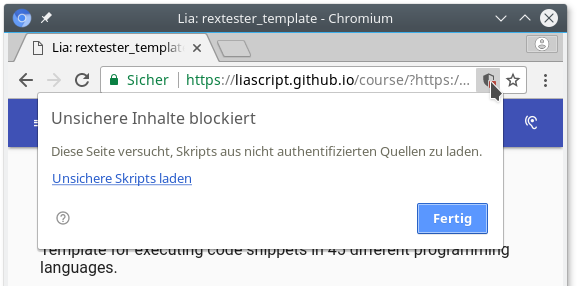

<!--

author:   André Dietrich
email:    andre.dietrich@ovgu.de
version:  1.0.0
language: en
narrator: US English Female

script:   https://ajax.googleapis.com/ajax/libs/jquery/1.11.3/jquery.min.js

@NASM:        15
@C_sharp:      1
@CPP:          7
@clang_CPP:   27
@visual_CPP:  28
@clang_C:     26
@visual_C:    29
@LISP:        18
@D:           30
@F_sharp:      3
@GO:          20
@Haskell:     11
@Java:         4
@JavaScript:  17
@LUA:         14
@NodeJS:      23
@Octave:      25
@ObjectiveC:  10
@Pascal:       9
@Perl:        13
@PHP:          8
@Prolog:      19
@Python:       5
@Python3:     24
@R:           31
@Ruby:        12
@Scala:       21
@Scheme:      22
@SQL_server:  16
@MySQL:       33
@Oracle:      35
@PostgreSQL:  34
@TCL:         32
@BASIC:        2
@ClientSide:  36
@Swift:       37
@BASH:        38
@ADA:         39
@Erlang:      40
@Elixir:      41
@OCaml:       42
@Kotlin:      43
@Brainfuck:   44
@Fortran:     45

@eval
<script>
//var result = null;
var error  = false;

$.ajax ({
    url: "http://rextester.com/rundotnet/api",
    type: "POST",
    async: true,
    data: { "LanguageChoice": "@0",
            "Program": `@code`,
            "Input": "",
            "CompilerArgs" : @2}
    }).done(function(data) {
        if (data.Errors == null) {
            result = data.Result;

            $('#Files').empty();

            if (data.Files != null) {
                for (var key in data.Files)
                {
                    var img_div = $(document.createElement('div'));
                    var img = $(document.createElement('img'));

                    img.attr('src', "data:image/png;base64," + data.Files[key]).height(600).width(700);

                    img.appendTo(img_div);
                    img_div.appendTo($('#Files@1'));
                }
            }

            evalOk(0, data.Result);
        } else {
            evalErr(0, data.Errors, [[{ row : 1, column : 1, text : "error",
              type : "error" }]]);
        }
    }).fail(function(data, err) {
        evalErr(0, JSON.stringify(err), [[{ row : 1, column : 1, text : "error",
          type : "error" }]]);
    });

"LIA wait!"
</script>

<div id="Files@1"> </div>
@end

-->

# rextester_template

Template for executing code snippets in 45 different programming languages by
using the [rextester api](http://rextester.com).

If you are on github, then see the rendered version [here](https://liascript.github.io/course/?https://raw.githubusercontent.com/liaScript/rextester_template/master/README.md)

github-project: https://github.com/liaScript/rextester_template

                               --{{0}}--
Unfortunately, to be able to use rextester you will have to allow active mixed
mode content, but its worth it, see for example the output of the [R-program](https://liascript.github.io/course/?https%3A%2F%2Fraw.githubusercontent.com%2FliaScript%2Frextester_template%2Fmaster%2FREADME.md%2333). To enable this setting in your browser, follow
the following steps or go to the proxied version of this document.

**Proxy:**

Click [here](https://liascript.github.io/course/?https://raw.githubusercontent.com/liaScript/rextester_template/master/Proxy.md) to get to the proxied version of this template.

**Firefox:**

1. enter about:config in your browser-url
2. search for "security.mixed_content.block_active_content"
3. double-click on it, to disable it (set to false)

**Chrome(ium)**

Click on the shield in upper right corner and load unsecure content, as it is
depicted below.



                               --{{1}}--
If you want to change some of the code snippets, simply double-click on them to
enter the edit mode.

## Ada

```ada
--GNAT 4.9.3

with Ada.Text_IO; use Ada.Text_IO;
procedure Hello is
begin
    Put_Line ("Hello, world!");
end Hello;
```
@eval(@ADA,0,"")

## Assembly

```armasm
;nasm 2.11.08

section .data
    hello:     db 'Hello world!',10    ; 'Hello world!' plus a linefeed character
    helloLen:  equ $-hello             ; Length of the 'Hello world!' string

section .text
	global _start

_start:
	mov eax,4            ; The system call for write (sys_write)
	mov ebx,1            ; File descriptor 1 - standard output
	mov ecx,hello        ; Put the offset of hello in ecx
	mov edx,helloLen     ; helloLen is a constant, so we don't need to say
	                     ;  mov edx,[helloLen] to get it's actual value
	int 80h              ; Call the kernel

	mov eax,1            ; The system call for exit (sys_exit)
	mov ebx,0            ; Exit with return code of 0 (no error)
	int 80h;
```
@eval(@NASM,0,"")

## BASH

```bash
#!/bin/bash
# GNU bash, version 4.3.46

echo "Hello, world!";
```
@eval(@BASH,0,"")

## Brainfuck

This program prints out the words Hello World!:

```brainfuck
1 +++++ +++               Set Cell #0 to 8
2 [
3     >++++               Add 4 to Cell #1; this will always set Cell #1 to 4
4     [                   as the cell will be cleared by the loop
5         >++             Add 4*2 to Cell #2
6         >+++            Add 4*3 to Cell #3
7         >+++            Add 4*3 to Cell #4
8         >+              Add 4 to Cell #5
9         <<<<-           Decrement the loop counter in Cell #1
10     ]                   Loop till Cell #1 is zero
11     >+                  Add 1 to Cell #2
12     >+                  Add 1 to Cell #3
13     >-                  Subtract 1 from Cell #4
14     >>+                 Add 1 to Cell #6
15     [<]                 Move back to the first zero cell you find; this will
16                         be Cell #1 which was cleared by the previous loop
17     <-                  Decrement the loop Counter in Cell #0
18 ]                       Loop till Cell #0 is zero
19
20 The result of this is:
21 Cell No :   0   1   2   3   4   5   6
22 Contents:   0   0  72 104  88  32   8
23 Pointer :   ^
24
25 >>.                     Cell #2 has value 72 which is 'H'
26 >---.                   Subtract 3 from Cell #3 to get 101 which is 'e'
27 +++++ ++..+++.          Likewise for 'llo' from Cell #3
28 >>.                     Cell #5 is 32 for the space
29 <-.                     Subtract 1 from Cell #4 for 87 to give a 'W'
30 <.                      Cell #3 was set to 'o' from the end of 'Hello'
31 +++.----- -.----- ---.  Cell #3 for 'rl' and 'd'
32 >>+.                    Add 1 to Cell #5 gives us an exclamation point
33 >++.                    And finally a newline from Cell #6
```
@eval(@Brainfuck,0,"")

The same program in minimised form:

```brainfuck
++++++++[>++++[>++>+++>+++>+<<<<-]>+>+>->>+[<]<-]>>.>---.+++++++..+++.>>.<-.<.+++.------.--------.>>+.>++.
```
@eval(@Brainfuck,1,"")

## C

```c
#include  <stdio.h>

int main(void)
{
    printf("Hello, world!\\n");
    return 0;
}
```
@eval(@clang_C,1,"-Wall -std=gnu99 -O2 -o a.out source_file.c")

## C++

```cpp
#include <iostream>

int main()
{
    std::cout << "Hello, world!\\n";
}
```
@eval(@CPP,1,"-Wall -std=c++14 -O2 -o a.out source_file.cpp")

## C#

``` csharp
using System;
using System.Collections.Generic;
using System.Linq;
using System.Text.RegularExpressions;

namespace Rextester
{
    public class Program
    {
        public static void Main(string[] args)
        {
            //Your code goes here
            Console.WriteLine("Hello, world!");
        }
    }
}
```
@eval(@C_sharp, 33,"")

## D

``` d
//DMD64 D Compiler 2.072.2

import std.stdio;

void main()
{
    writeln("Hello, World!");
}
```
@eval(@D, 33,"source_file.d -ofa.out")


## Elixir <!-- height="22px" -->

```elixir
#Elixir 1.1.0

IO.puts "Hello, world!"
```
@eval(@Elixir, 33,"")

## Erlang

```erlang
%Erlang 7.3
%dont change first 3 lines

-module(source).
	-export([entry_point/0]).

	entry_point() ->
		io:fwrite("Hello, world\n").
```
@eval(@Erlang, 33,"")

## F#

```fsharp
//F# Compiler for F# 4.0 (Open Source Edition), Mono 4.2.1

open System
printfn "Hello, World!"
```
@eval(@F_sharp, 33,"")

## Fortran

```fortran
!gfortran, gcc version 5.4.0 20160609

program hello
    print *, "Hello World!"
end program hello
```
@eval(@Fortran, 33,"")

## Go

``` go
//go 1.6.2

package main
import "fmt"

func main() {
    fmt.Printf("hello, world\\n")
}
```
@eval(@GO, 33,"-o a.out source_file.go")

## Haskell

```haskell
--ghc 7.10

main = print $ "Hello, world!"
```
@eval(@Haskell, 33,"-o a.out source_file.hs")


## Java


``` java
//'main' method must be in a class 'Rextester'.
//Compiler version 1.8.0_111

import java.util.*;
import java.lang.*;

class Rextester
{
    public static void main(String args[])
    {
        System.out.println("Hello, World!");
    }
}
```
@eval(@Java, 33,"")


## Kotlin

```kotlin
//Kotlin 1.1

fun main(args: Array<String>) {
    println("Hello, world!")
}
```
@eval(@Kotlin, 33,"")


## LISP <!-- height="21px" -->

```lisp
;gnu clisp 2.49

(print "Hello, world!")
```
@eval(@LISP, 33,"")

## LUA

```lua
--lua 5.3

print ("Hello, World!")
```
@eval(@LUA, 33,"")

## MySQL

```SQL
#MySQL 5.7.12
#please drop objects you've created at the end of the script
#or check for their existance before creating
#'\\' is a delimiter

select version() as 'mysql version'
```
@eval(@MySQL, 33,"")

## NodeJS

```js
//nodejs v4.2.6

console.log("Hello, World!");
```
@eval(@NodeJS, 33,"")

## OCaml

```ocaml
(*The OCaml compiler, version 4.02.3*)

print_string "Hello, world!\\n";;
```
@eval(@OCaml, 33,"")

## Octave

```matlab
% To view plots after 'plot' (and other plot-producing commands) this command
% must follow: 'print -dpng some_unique_plot_name.png;'
% It exports current plot to png image which then is sent to your browser
% GNU Octave 4.0.0

x=1:0.1:10;
plot(x, sin(x));
print -dpng some_name.png;
```
@eval(@Octave, 33,"")

## Objective-C

```ObjectiveC
//gcc 5.0.4

#import <Foundation/Foundation.h>

int main (int argc, const char * argv[])
{
    NSAutoreleasePool *pool = [[NSAutoreleasePool alloc] init];
    NSLog (@"Hello, World!");
    [pool drain];
    return 0;
}
```
@eval(@ObjectiveC, 33,"-MMD -MP -DGNUSTEP -DGNUSTEP_BASE_LIBRARY=1 -DGNU_GUI_LIBRARY=1 -DGNU_RUNTIME=1 -DGNUSTEP_BASE_LIBRARY=1 -fno-strict-aliasing -fexceptions -fobjc-exceptions -D_NATIVE_OBJC_EXCEPTIONS -pthread -fPIC -Wall -DGSWARN -DGSDIAGNOSE -Wno-import -g -O2 -fgnu-runtime -fconstant-string-class=NSConstantString -I. -I /usr/include/GNUstep -I/usr/include/GNUstep -o a.out source_file.m -lobjc -lgnustep-base")

## Oracle

```SQL
--Oracle 11g Express Edition
--please drop objects you've created at the end of the script
--or check for their existance before creating
--'\\' is a delimiter

select banner as "oracle version" from v$version
```
@eval(@Oracle, 33,"")

## Pascal

```pascal
//fpc 3.0.0

program HelloWorld;

begin
    writeln('Hello, world!');
end.
```
@eval(@Pascal, 33,"")

## Perl

```perl
#perl 5.22.1

print "Hello World\\n";
```
@eval(@Perl, 33,"")

## PHP

```PHP
<?php //php 7.0.8

    echo "Hello, world! "

?>
```
@eval(@PHP, 33,"")

## PostgreSQL

```SQL
--PostgreSQL 9.6
--'\\' is a delimiter

select version() as postgresql_version
```
@eval(@PostgreSQL, 33,"")

## Prolog

```prolog
exists(A, list(A, _, _, _, _)).
exists(A, list(_, A, _, _, _)).
exists(A, list(_, _, A, _, _)).
exists(A, list(_, _, _, A, _)).
exists(A, list(_, _, _, _, A)).

rightOf(R, L, list(L, R, _, _, _)).
rightOf(R, L, list(_, L, R, _, _)).
rightOf(R, L, list(_, _, L, R, _)).
rightOf(R, L, list(_, _, _, L, R)).

middle(A, list(_, _, A, _, _)).

first(A, list(A, _, _, _, _)).

nextTo(A, B, list(B, A, _, _, _)).
nextTo(A, B, list(_, B, A, _, _)).
nextTo(A, B, list(_, _, B, A, _)).
nextTo(A, B, list(_, _, _, B, A)).
nextTo(A, B, list(A, B, _, _, _)).
nextTo(A, B, list(_, A, B, _, _)).
nextTo(A, B, list(_, _, A, B, _)).
nextTo(A, B, list(_, _, _, A, B)).

puzzle(Houses) :-
    exists(house(red, english, _, _, _), Houses),
    exists(house(_, spaniard, _, _, dog), Houses),
    exists(house(green, _, coffee, _, _), Houses),
    exists(house(_, ukrainian, tea, _, _), Houses),
    rightOf(house(green, _, _, _, _), house(ivory, _, _, _, _), Houses),
    exists(house(_, _, _, oldgold, snails), Houses),
    exists(house(yellow, _, _, kools, _), Houses),
    middle(house(_, _, milk, _, _), Houses),
    first(house(_, norwegian, _, _, _), Houses),
    nextTo(house(_, _, _, chesterfield, _), house(_, _, _, _, fox), Houses),
    nextTo(house(_, _, _, kools, _),house(_, _, _, _, horse), Houses),
    exists(house(_, _, orangejuice, luckystike, _), Houses),
    exists(house(_, japanese, _, parliament, _), Houses),
    nextTo(house(_, norwegian, _, _, _), house(blue, _, _, _, _), Houses),
    exists(house(_, _, water, _, _), Houses),
    exists(house(_, _, _, _, zebra), Houses).

solution(WaterDrinker, ZebraOwner) :-
    puzzle(Houses),
    exists(house(_, WaterDrinker, water, _, _), Houses),
    exists(house(_, ZebraOwner, _, _, zebra), Houses).
```
@eval(@Prolog,1,"")


## Python2

```python
for i in range(10):
    print i
```
@eval(@Python,0,"")

## Python3

```python
for i in range(10):
    print("Hello World", i)
```
@eval(@Python3,0,"")

## R

```R
require(stats) # for lowess, rpois, rnorm
plot(cars)
lines(lowess(cars))

plot(sin, -pi, 2*pi) # see ?plot.function

## Discrete Distribution Plot:
plot(table(rpois(100, 5)), type = "h", col = "red", lwd = 10, main = "rpois(100, lambda = 5)")

## Simple quantiles/ECDF, see ecdf() {library(stats)} for a better one:
plot(x <- sort(rnorm(47)), type = "s")
points(x, cex = .5, col = "dark red")
```
@eval(@R,1,"")

## Ruby

```ruby
#ruby 2.3.1

puts "Hello, world!"
```
@eval(@Ruby,1,"")

## Scala

```scala
//'Rextester' class is the entry point for your code.
//Don't declare a package.
//scala 2.11.7

object Rextester extends App {
    println("Hello, World!")
}
```
@eval(@Scala,1,"")

## Scheme

```lisp
;guile 2.0.11

(display "Hello, World!")
```
@eval(@Scheme,1,"")

## SQL-Server

```SQL
--Sql Server 2014 Express Edition
--Batches are separated by 'go'

select @@version as 'sql server version'
```
@eval(@SQL_server,1,"")

## Swift

```swift
//swift 3.0.2

print("Hello, world!")
```
@eval(@Swift,1,"")


## TCL

``` tcl
#tclsh 8.6

puts "Hello, world!"
```
@eval(@TCL,1,"")

## Visual BASIC

``` purebasic
'Rextester.Program.Main is the entry point for your code. Don't change it.
'Compiler version 11.0.50709.17929 for Microsoft (R) .NET Framework 4.5

Imports System
Imports System.Collections.Generic
Imports System.Linq
Imports System.Text.RegularExpressions

Namespace Rextester
    Public Module Program
        Public Sub Main(args() As string)
            'Your code goes here
            Console.WriteLine("Hello, world!")
        End Sub
    End Module
End Namespace
```
@eval(@BASIC,1,"")
